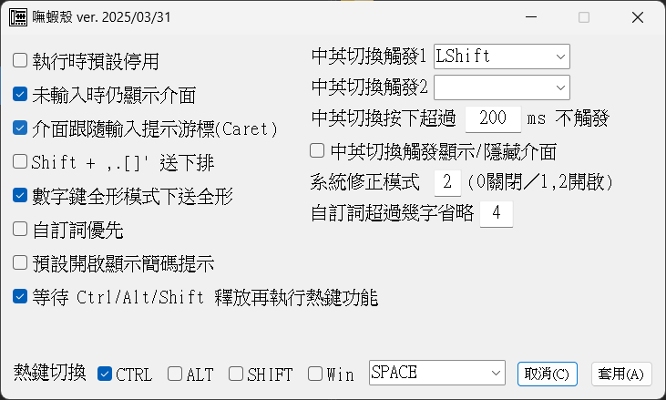

# Boshiahk2 - 嘸蝦殼 V2  
免安裝的嘸蝦米輸入工具，以 AutoHotkey V2 開發。  
本程式會攔截鍵盤事件，所以會被某些掃毒軟體誤判，附上掃毒結果給大家參考：  
[32位元執行檔(VirusTotal)](https://www.virustotal.com/gui/file/2831bb4021642585650003b95ccca30745cbd47e2d1c31b36dc99ca10a8f629c?nocache=1)  
[32位元執行檔(Virscan)](https://www.virscan.org/report/2831bb4021642585650003b95ccca30745cbd47e2d1c31b36dc99ca10a8f629c)  
[64位元執行檔(VirusTotal)](https://www.virustotal.com/gui/file/9315e78527cf2cbfeb4c86a25be57598476aa551c8f4012c99384986eb507d44?nocache=1)  
[64位元執行檔(Virscan)](https://www.virscan.org/report/9315e78527cf2cbfeb4c86a25be57598476aa551c8f4012c99384986eb507d44)

# 緣起
嘸蝦米輸入法是一個很好用的輸入法，但並不是每台電腦都有嘸蝦米輸入法。  
使用嘸蝦米輸入法的人都會遇到一個問題，換了一台電腦就不一定有嘸蝦米輸入法可用，大大影響工作效率。  
偽蝦米輸入法雖然好用，但已經沒有在維護，在新的程式上開始有不相容的情況發生…  
為了方便在任何電腦上都能使用，我興起了一個念頭，使用 AHK 來開發一個免安裝的嘸蝦米輸入工具，讓我能夠在任何電腦上使用嘸蝦米輸入法打中文，並且也讓嘸蝦米的使用者在遇到輸入法的問題時，能夠有另一個選擇。  
只要 AHK 還能用，這個工具就會一直存在，持續維護。

### 更新 2023-06-03
- 新增選項，可以在設定介面中針對顯示簡碼提示做設定。

### 更新 2023-04-07
- 修正在英數模式下啟用/停用輸入法時，系統列圖示顯示不正確的問題。

### 更新 2023-04-01
- 每個表格檔可以自訂系統列要顯示的圖示了，可參閱新的 INI 檔。
- 將非預設表格檔移到`Table_`資料夾中，有需要的再自行移動檔案加入。
- 目前系統列可以顯示全形、英數、自訂表格圖示。

# 下載方式
- 直接到 [Release](https://github.com/yurenli0217/Boshiahk2/releases) 頁面下載即可。
- 因為程式多少會有被誤判的機會，所以同時提供 x86 和 x64 的執行檔，下載時只要選擇一個不會被誤判的下載即可。
- 建立一個資料夾，例如 `Boshiahk2`。將 `Boshiahk2_Config.zip` 內的檔案解壓縮到此資料夾後，再把執行檔放進這個資料夾執行即可開始使用。

# 介面範例
### 程式中所使用的字體是[「霞鶩文楷」](https://github.com/lxgw/LxgwWenKai)。
  
  

# 程式執行前置作業
- AutoHotkey 本身有鍵盤攔截功能，所以有時會被防毒軟體誤判，因此提供 32 位元與 64 位元的執行檔，請在解壓縮後，先選擇一個不會被系統誤判的執行檔。
- `Table`資料夾內放的是表格檔，`Config`資料夾放的是其它設定檔。
- 程式執行時，會載入 `Config\LastPosition.ini` 儲存的座標位置，輸入介面有變更位置時會更新此檔案。刪除此檔案，執行時輸入介面會以預設值顯示在螢幕左下角。
- 若是有多個螢幕時，輸入介面會自動移到焦點視窗所在的螢幕，介面會顯示在一樣的相對位置。

## 熱鍵功能 (2022-07-03 更新)
除了輸入法的開啟/關閉，其它的熱鍵皆在輸入法啟用時才會作用。
- `Shift-Space`: 半形/全形 輸入。
- `Shift+,.` 或 `Pgup/Pgdn`: 在多頁選字時，切換上下頁。
- `Ctrl-Alt-B`: 開啟自訂字詞檔。
- `Ctrl-Alt-C`: 查看上一次送字之拆碼。
- `Ctrl-Alt-G`: 重複上一次送出的字。
- `Ctrl-Alt-K`: 複製一個文字後，按下此熱鍵可以顯示該字的所有拆碼。
- `Ctrl-Alt-L`: 切換送字後顯示3碼以內的拆碼
- `Ctrl-Alt-O`: 輸入介面位置重設。
- `Ctrl-Alt-P`: 進入注音模式。
- `Ctrl-Alt-R`: 重新載入程式。
- `Ctrl-Alt-X`: 結束程式。
- `Ctrl-Alt-Shift-C`: 查詢焦點視窗的 Class Name。
- `Ctrl-Alt-Shift-T`: 查詢焦點視窗的視窗標題。

## 查詢功能
- 萬用碼查碼: 先輸入前導碼`[`，再輸入字根，不確定字根用`.`來代表。如`[A..P`，會顯示字碼首碼為`A`、尾碼為`P`、以及字根數為「四碼」的選字。
- 查詢注音與同音字: 先輸入字根碼，出現選字後，用「Ctrl + 選字編號」選擇要查的注音，會出現該字的所有注音，此時可再進一步選擇注音再查同音字。

## 修改 INI 設定檔
- `Main.ini`已可以透過設定介面修改設定，也可手動修改設定檔
- 設定檔中已有針對各項設定值簡述用法。
- 使用程式前可先詳細參閱 INI 檔內說明。
### ※注意※ 如果 INI 檔文字編碼格式不是 UTF-16LE，程式將無法正常讀取設定，用記事本開啟另存成 UTF16-LE 即可。這是 Windows 本身的限制。

## FontName 與 FontNameExt 使用範例
使用的方式用全字庫來說明，全字庫正楷體中有兩個檔案名稱:  
`TW-Kai-98_1.ttf`  
`TW-Kai-Ext-B-98_1.ttf`  
其中`TW-Kai-Ext-B-98_1.ttf`儲存的文字是在Unicode `0x20000` 開始的文字，首先將字型安裝到系統，然後再使用以下設定值  
`FontName = 全字庫正楷體`  
`FontNameExt =全字庫正楷體 Ext-B`  
這樣在 Unicodde 0x20000 以後的文字就使用擴展字集區的字型了。

## 熱鍵功能
在`Hotkey.ini`中可自訂熱鍵，方便送出一連串的鍵盤動作。  
熱鍵的對應可參考 AHK 官網的鍵盤對應表。舉例如下:  
`^c||||^v `  
代表先送出Ctrl-c，然後暫停200ms，再送出Ctrl-v，其中`|`符號代表間隔50ms，上面有4個，所以就變成了200ms。

## 加字加詞額外功能
加字加詞中我實作了一個可以呼叫外部程式的功能。  
例: `,calc# calc`  
輸入「,calc」按下空白鍵後，即執行 Windows 內建小算盤。  
例: `,drv# c:\`  
輸入「,drv」按下空白鍵後，會用檔案總管開啟路徑C:\。  

## Config\ClipAuto.txt
- 檔案內容為視窗的 Class Name 清單，或是視窗標題，程式執行時會讀取該檔。
- 若是焦點視窗有符合 Class Name 或視窗標題，就會自動以剪貼簿送字。
- 可以用上述的熱鍵功能取得焦點視窗的 Class Name 或視窗標題。

如果想要符合的是 Class Name，每一行用*開頭，後面接 Class Name，如  
`*Notepad`  
只要 Class Name 為 Notepad 的都會自動用剪貼簿貼上。  

如果想要符合的是視窗標題，每一行直接輸入視窗標題包含的字串，如  
`批踢踢實業坊`  
視窗標題只要包含此字串，就會自動以剪貼簿送字。  
視窗標題也可以支援正規表示法比對字串，這是比較進階的用法，有興趣的可以試試。  
視窗標題比對時的英文文字不分大小寫。

## 系統輸入法和語系設定
嘸蝦殼輸入介面的運作屬外掛方式輸入中文，若要正常運作，系統內建的輸入法要先進行設定。  
系統的語言設定和輸入法設定可以參照以下兩種方式:  
1. 語系設定成英文語系  
  
此模式下使用外掛式中文輸入最穩定，但若是遇到某些應用程式需要系統輸入法在中文語系下才能輸入中文時，就必須要使用第二種方法。

2. 輸入法設定成倉頡英數模式(非必要時不建議)  
  
設定成倉頡輸入法，可以配合 INI 設定項 `SysImePatch`，程式會自動監控將系統輸入法狀態維持在英數模式。  
例如 Excel 中的 VBA 程式編輯，就會需要用到這種方式來輸入中文。

# 歷史更新
[連結](https://github.com/yurenli0217/Boshiahk2/blob/main/History.md)
