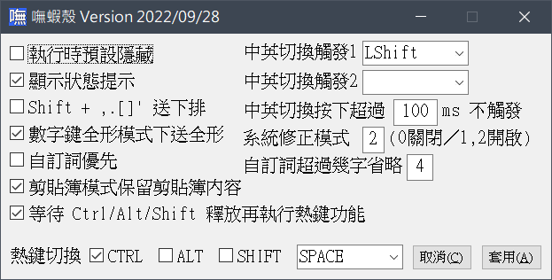

# Boshiahk2 - 嘸蝦殼 V2  
免安裝的嘸蝦米輸入工具，以 AutoHotkey V2 開發。  
本程式會攔截鍵盤事件，所以會被某些掃毒軟體誤判，附上掃毒結果給大家參考：  
[32位元執行檔(VirusTotal)](https://www.virustotal.com/gui/file/2831bb4021642585650003b95ccca30745cbd47e2d1c31b36dc99ca10a8f629c?nocache=1)  
[32位元執行檔(Virscan)](https://www.virscan.org/report/2831bb4021642585650003b95ccca30745cbd47e2d1c31b36dc99ca10a8f629c)  
[64位元執行檔(VirusTotal)](https://www.virustotal.com/gui/file/9315e78527cf2cbfeb4c86a25be57598476aa551c8f4012c99384986eb507d44?nocache=1)  
[64位元執行檔(Virscan)](https://www.virscan.org/report/9315e78527cf2cbfeb4c86a25be57598476aa551c8f4012c99384986eb507d44)

# 緣起
嘸蝦米輸入法是一個很好用的輸入法，但並不是每台電腦都有嘸蝦米輸入法。
使用嘸蝦米輸入法的人都會遇到一個問題，換了一台電腦就不一定有嘸蝦米輸入法可用，大大影響工作效率。
偽蝦米輸入法雖然好用，但已經沒有在維護，在新的程式上開始有不相容的情況發生…
為了方便在任何電腦上都能使用，我興起了一個念頭，使用 AHK 來開發一個免安裝的嘸蝦米輸入工具，讓我能夠在任何電腦上使用嘸蝦米輸入法打中文，並且也讓嘸蝦米的使用者在遇到輸入法的問題時，能夠有另一個選擇。
只要 AHK 還能用，這個工具就會一直存在，持續維護。

### 更新 2023-04-07
- 修正在英數模式下啟用/停用輸入法時，系統列圖示顯示不正確的問題。
- 後續釋出的版本，都會放在 [Release](https://github.com/yurenli0217/Boshiahk2/releases) 頁面中，將執行檔與設定檔分開，以利會遇到誤判的使用者可以擇一下載使用。

### 更新 2023-04-01
- 每個表格檔可以自訂系統列要顯示的圖示了，可參閱新的 INI 檔。
- 將非預設表格檔移到`Table_`資料夾中，有需要的再自行移動檔案加入。
- 目前系統列可以顯示全形、英數、自訂表格圖示。

# 介面範例
### 程式中所使用的字體是[「霞鶩文楷」](https://github.com/lxgw/LxgwWenKai)。
  
  

# 下載方式
- 直接到 [Release](https://github.com/yurenli0217/Boshiahk2/releases) 頁面下載即可。
- 因為程式多少會有被誤判的機會，所以同時提供 x86 和 x64 的執行檔，下載時只要選擇一個不會被誤判的下載即可。
- 建立一個資料夾，例如 `Boshiahk2`。將 `Boshiahk2_Config.zip` 內的檔案解壓縮到此資料夾後，再把執行檔放進這個資料夾執行即可開始使用。

# 程式執行前置作業
- AutoHotkey 本身有鍵盤攔截功能，所以有時會被防毒軟體誤判，因此提供 32 位元與 64 位元的執行檔，請在解壓縮後，先選擇一個不會被系統誤判的執行檔。
- `Table`資料夾內放的是表格檔，`Config`資料夾放的是其它設定檔。
- 程式執行時，會載入 `Config\LastPosition.ini` 儲存的座標位置，輸入介面有變更位置時會更新此檔案。刪除此檔案，執行時輸入介面會以預設值顯示在螢幕左下角。
- 若是有多個螢幕時，輸入介面會自動移到焦點視窗所在的螢幕，介面會顯示在一樣的相對位置。

## 熱鍵功能 (2022-07-03 更新)
除了輸入法的開啟/關閉，其它的熱鍵皆在輸入法介面開啟時才會作用。
- `Shift-Space`: 半形/全形 輸入。
- `Shift+,.` 或 `Pgup/Pgdn`: 在多頁選字時，切換上下頁。
- `Ctrl-Alt-B`: 開啟自訂字詞檔。
- `Ctrl-Alt-C`: 查看上一次送字之拆碼。
- `Ctrl-Alt-G`: 重複上一次送出的字。
- `Ctrl-Alt-K`: 複製一個文字後，按下此熱鍵可以顯示該字的所有拆碼。
- `Ctrl-Alt-L`: 切換送字後顯示3碼以內的拆碼
- `Ctrl-Alt-O`: 輸入介面位置重設。
- `Ctrl-Alt-P`: 進入注音模式。
- `Ctrl-Alt-R`: 重新載入程式。
- `Ctrl-Alt-X`: 結束程式。
- `Ctrl-Alt-Shift-C`: 查詢焦點視窗的 Class Name。
- `Ctrl-Alt-Shift-T`: 查詢焦點視窗的視窗標題。

## 查詢功能
- 萬用碼查碼: 先輸入前導碼`[`，再輸入字根，不確定字根用`.`來代表。如`[A..P`，會顯示字碼首碼為`A`、尾碼為`P`、以及字根數為「四碼」的選字。
- 查詢注音與同音字: 先輸入字根碼，出現選字後，用「Ctrl + 選字編號」選擇要查的注音，會出現該字的所有注音，此時可再進一步選擇注音再查同音字。

## 修改 INI 設定檔
- `Main.ini`已可以透過設定介面修改設定，也可手動修改設定檔
- 設定檔中已有針對各項設定值簡述用法。
- 使用程式前可先詳細參閱 INI 檔內說明。
### ※注意※ 如果 INI 檔文字編碼格式不是 UTF-16LE，程式將無法正常讀取設定，用記事本開啟另存成 UTF16-LE 即可。這是 Windows 本身的限制。

## FontName 與 FontNameExt 使用範例
使用的方式用全字庫來說明，全字庫正楷體中有兩個檔案名稱:  
`TW-Kai-98_1.ttf`  
`TW-Kai-Ext-B-98_1.ttf`  
其中`TW-Kai-Ext-B-98_1.ttf`儲存的文字是在Unicode `0x20000` 開始的文字，首先將字型安裝到系統，然後再使用以下設定值  
`FontName = 全字庫正楷體`  
`FontNameExt =全字庫正楷體 Ext-B`  
這樣在 Unicodde 0x20000 以後的文字就使用擴展字集區的字型了。

## 熱鍵功能
在`Hotkey.ini`中可自訂熱鍵，方便送出一連串的鍵盤動作。  
熱鍵的對應可參考 AHK 官網的鍵盤對應表。舉例如下:  
`^c||||^v `  
代表先送出Ctrl-c，然後暫停200ms，再送出Ctrl-v，其中`|`符號代表間隔50ms，上面有4個，所以就變成了200ms。

## 加字加詞額外功能
加字加詞中我實作了一個可以呼叫外部程式的功能。  
例: `,calc# calc`  
輸入「,calc」按下空白鍵後，即執行 Windows 內建小算盤。  
例: `,drv# c:\`  
輸入「,drv」按下空白鍵後，會用檔案總管開啟路徑C:\。  

## Config\ClipAuto.txt
- 檔案內容為視窗的 Class Name 清單，或是視窗標題，程式執行時會讀取該檔。
- 若是焦點視窗有符合 Class Name 或視窗標題，就會自動以剪貼簿送字。
- 可以用上述的熱鍵功能取得焦點視窗的 Class Name 或視窗標題。

如果想要符合的是 Class Name，每一行用*開頭，後面接 Class Name，如  
`*Notepad`  
只要 Class Name 為 Notepad 的都會自動用剪貼簿貼上。  

如果想要符合的是視窗標題，每一行直接輸入視窗標題包含的字串，如  
`批踢踢實業坊`  
視窗標題只要包含此字串，就會自動以剪貼簿送字。  
視窗標題也可以支援正規表示法比對字串，這是比較進階的用法，有興趣的可以試試。  
視窗標題比對時的英文文字不分大小寫。

## 系統輸入法和語系設定
嘸蝦殼輸入介面的運作屬外掛方式輸入中文，若要正常運作，系統內建的輸入法要先進行設定。  
系統的語言設定和輸入法設定可以參照以下兩種方式:  
1. 語系設定成英文語系  
  
此模式下使用外掛式中文輸入最穩定，但若是遇到某些應用程式需要系統輸入法在中文語系下才能輸入中文時，就必須要使用第二種方法。

2. 輸入法設定成倉頡英數模式(非必要時不建議)  
  
設定成倉頡輸入法，可以配合 INI 設定項 `SysImePatch`，程式會自動監控將系統輸入法狀態維持在英數模式。  
例如 Excel 中的 VBA 程式編輯，就會需要用到這種方式來輸入中文。

# 歷史更新

### 更新 2023-03-25
- 更換圖示
- 嘗試加入新圖示: 在改變輸入模式為英數與全形時，系統列圖示也會跟著改變，若穩定的話，未來有機會針對每個表格檔指定要使用的圖示檔。

### 更新 2023-03-22
- 修正候選字設定超過10時導致程式發生錯誤，此程式目前候選字最多應為10個，設定值超過10還是只會顯示10個

### 更新 2023-03-04
- 嘗試修正 Windows 工具列在螢幕的上、左、右時，介面顯示的預設位置錯誤問題。
- 修改剪貼簿功能，新增可用 Windows API 方式貼上的選項，有些程式需要用 API 才會穩定。

### 更新 2023-02-22
- 新增在載入表格時，會將自訂字詞和通用表格套用在每個表格檔中。例如用`,,j`切換到日文下，自訂字詞和通用表格的內容一樣可以適用。

### 更新 2023-01-02
- 修正切換表格發生的錯誤。

### 更新 2022-12-27
- 修改 ToolTip，將拆碼提示另外顯示在介面的上方，`Ctrl-Alt-L`，`Ctrl-Alt-K`，`Ctrl-Alt-C`以及注音查詢這幾項功能都會將拆碼提示顯示在輸入介面上方。
- `Style.ini`中加入`FontSizeKeyList`設定，可以設定顯示拆碼提示的文字尺寸
- 此版移除了指定 TTF 字型檔的功能，只保留字型名稱設定，並另提供一個工具`LoadFontExt.exe`，可以自動將同一目錄下面的字型檔案載入到系統中使用，不需要經過安裝。關機後就會不見，適合在會常在不同的電腦中使用的情況。

### 更新 2022-12-21
- AutoHotkey 2.0 終於正式發佈了，此版本將核心替換為正式版
- 此版本中，將拆碼顯示(`Ctrl-Alt-K` 與 `Ctrl-Alt-C`)改成以 ToolTip 形式顯示，會顯示在輸入介面的上方５秒鐘。

### 更新 2022-10-22
- AHK 核心更新(B12)
- 新增程式內部的熱鍵功能設定「等待 Ctrl/Alt/Shift 釋放後再執行」，有的電腦不需開啟，按下組合熱鍵就能正常執行，不能正常執行者再開啟此功能即可。

### 更新 2022-10-01
- 剪貼簿模式下，新增設定可以切換是否保留原本的簿貼簿內容。要保留剪貼簿內容需要做的程序比較多，可能有些電腦會不相容，因此將這個功能做成可切換，以利蝦友們選擇。

### 更新 2022-09-28
- 嘗試修正抓取視窗發生的錯誤訊息，此版本在偵測視窗時，加入了條件，若是仍無法抓取，會出現「無法抓取視窗」的訊息，若有出現的蝦友們，請幫忙回報訊息出現時的操作環境，我再進一步研究，謝謝。

### 更新 2022-09-11
- 右鍵選單加入「開啟設定目錄」的選項，方便直接開啟設定檔存放的資料夾修改設定。

### 更新 2022-09-08
- 嘗試修正在剪貼簿模式下的問題，請大家再幫忙測試回報。
- 這一次更新的版本，我只修正了我遇到的問題，但我想應該還是有我沒遇到的問題。
- 這次想要實作保留剪貼簿內容的功能，如果可以的話在有問題的情況下，用畫面錄製的方式回報給我，以利我嘗試修正。

### 更新 2022-09-04 二次更新
- 新增功能: 在有選字的情況下，按數字鍵盤的數字可以選字送出。
- 二次更新: 剪貼簿模式下，會保留原本剪貼簿的內容不被覆蓋(測試中)。

### 更新 2022-08-14
- 在注音模式(Ctrl-Alt-P)下，輸入注音符號後，按下`Enter`可以直接將輸入的注音送出。

### 更新 2022-08-06
- 更新 AutoHotkey 核心版本 (Beta7)

### 更新 2022-07-10
- 自訂詞可設定最長顯示長度，過長會用「…」表示。
- 系統列和狀態提示按下右鍵都會顯示選單，並在選單項目上加上快捷鍵。

### 更新 2022-07-09
- 因誤判的關係，提供另一種格式的執行檔，`Boshiahk2x64m.exe`、`Boshiahk2x86m.exe`，請大家試試看，哪一種的誤判率較低。

### 更新 2022-07-03
- 提供設定介面，提供的設定內容為`Main.ini`對應的設定值，這些都算是常用與一般使用者會變動的設定。
- 對介面按下右鍵，可以跳出設定介面的視窗，系統列也新增可以開啟設定介面的選項。
- `Table.ini`、`Hotkey.ini`、`Style.ini`、`Hotkey.ini`屬於比較進階的設定，以及設定好之後就會很少更動，因此這幾個檔案相關的設定目前無考慮加入設定介面的選項中。
- 使用新版的 AHK 編譯，內部程式碼修正。

### 更新 2022-06-27
將 INI 檔案拆成數個設定檔，放到`Config`中:
- `Main.ini`: 主要設定
- `Table.ini`: 表格載入設定
- `Style.ini`: 顯示設定
- `Hotkey.ini`: 熱鍵設定
- 後續版本構想: 規劃設計一個視窗介面，可以直接修改 Main.ini 的設定值，後續就不用常常開 INI 修改設定，此版先將 Ctrl-Alt-I 熱鍵取消。  
- 此版的更新，將表格檔的歸類修改了一下，`Table`資料夾中，`Liu`開頭的檔名，字碼表是參考官方 7.x 版本，`M_`開頭的是蝦友`Fairry`整理的表格檔，考慮到很多蝦友應該還是比較習慣舊式的字碼對應，所以將此改為預設值，有特別需要的蝦友再到`Table.ini`中修改即可。
- 字型檔原本是放在跟執行檔同一路徑中，現在改為放到`Config`資料夾中。

### 更新 2022-04-20
- 修正: 偵測系統輸入法狀態有時會發生錯誤訊息的情況。
- 加入 INI 設定值 `UserPrior`，設定值為 1 時，拆碼重相同的情況下，可以將自訂字詞列為優先順序。

### 更新 2022-04-03
- 修正: 載入表格檔如果有遇到兩行以上相同的拆碼，載入時會將對應的字詞合併，不會覆蓋掉先前的。  

### 更新 2022-03-06
- 新增熱鍵 Ctrl-Alt-k。複製一個文字後，按下此熱鍵可以顯示該字的所有拆碼。
- 修正同音字(Ctrl+數字)查詢功能，按ESC取消但卻無效的情況。

### 更新 2022-01-14
- 熱鍵功能加入`|`符號做為加入暫停時間用，一個`|`代表暫停 50ms  
例: ^c||||^v  
代表先按Ctrl-C，然後暫停200ms後，按下Ctrl-V  
有些程式按鍵的反應時間不能太快，用這個方式可以改善問題。

### 更新 2022-01-09
- 新增熱鍵 `Ctrl-Alt-L` 可切換送字後是否顯示三碼內拆碼。
- 修改注音模式、同音字以及萬用碼的功能，在送字後會跳出視窗顯示該字的所有拆碼。

### 更新 2021-12-25
- 調整分號鍵：分號當字根時，必須要在第二字根碼開始才有效，這樣在全形模式下打分號時就不會有衝突了。

### 更新 2021-12-18
- 加入全域熱鍵設定功能  
我常會使用一項功能：設定某一組熱鍵後，可以送出連一串的按鍵動作。  
此次更新我將此功能整合到輸入法，如此便不需要另外一隻程式來輔助了。  
熱鍵設定屬 AHK 的內建功能，按鍵名稱與格式都與內建的一樣，因篇幅太大我在這裡無法說明，有興趣的可參考 AHK 的熱鍵介紹。  
我在設定檔內有給一個小範例，大家可以試試看。

### 更新 2021-11-20
- 加字加詞加入執行外部程式功能  
例: ,calc# calc  
輸入「,calc」按下空白鍵後，即執行 Windows 內建小算盤。

- 關於「快打」模式: 官蝦的快打模式，目前在本程式中還無法實作出來，未來應該也不容易實作。  
我想到的折衷方式是參考小小輸入法中可顯示最少字根碼的功能，在送字時，可以提示是否有簡字根碼，如果可行會再後續的釋出版本中加入此功能。

### 更新 2021-10-29
- 針對自動修正系統輸入法為英數模式的功能，做了修改，主要是嘗試避免偵測不到系統輸入法  
狀態時會跳出錯誤訊息。

### 更新 2021-10-21
- 加入設定值`NumpadFullWidth`，可以設定全形模式下，數字鍵盤的輸出模式。

### 更新 2021-10-14
- 修正無法複製視窗標題文字與ClassName的問題
- 修正開啟大寫模式注音輸入出錯的問題
- 繁中與共用表格檔更新 by Fairry

### 更新 2021-10-12
- 修正注音查詢功能的錯誤。
- 加入一設定值`ShowState`，可以設定無輸入時是否顯示狀態提示。
- 注音表格更新，套用 CNS 全字庫注音表格，可查詢的較全面。
- 修正其他錯誤。

### 更新 2021-10-11
- 這次的釋出版本有修改了操作功能，我將功能碼都改成了[快速鍵](#熱鍵功能-2021-10-11-更新)。
- 加入了同音字功能，跟查注音整合在一起了，請參閱下方[說明](#查詢功能-2021-10-11-更新)。
- 小問題修正。

### 更新 2021-10-06
- 修正 EnSwitch2 不設定時程式錯誤的問題
- `_common.txt`表格檔補上驚嘆號和問號的字根碼。
- 附上舊版的表格檔，在`Table2`資料夾，也是由PTT蝦友 Fairry 提供的，若是比較不習慣新的表格，可以改設定套用舊的表格檔。  
資料夾有一個空檔案的 common.txt 是為了相容性，裡面並無任何內容，因舊版表格檔的符號並沒有特別整理出來。
- 修正其他小問題。

### 更新 2021-10-03
- 修正注音模式下取消後，GDI+ 文字未更新的問題。
- 在全形模式下，「:」符號無法正常輸出成「：」。
- 修正數字1左邊的「~」符號，無法正常輸出。
- 介面全部用 GDI+ 來繪製，不再使用 GUI 模式，因此設定檔已全面更新。
- 針對字型設定，現在有兩個設定值 `FontName` 與 `FontNameExt`，使用的方式請參閱下方[說明](#fontname-與-fontnameext-使用範例)。
- 表格檔也做了更新，非常感謝PTT蝦友 Fairry 的幫忙，無私整理了表格檔，請參閱下方[說明](#表格檔架構)。
- 查注音念法的功能碼原為`[[`，但是會有衝突，所以功能碼改成`'[` 
- 加字加詞如果字根碼和原本表內相容，會附加在最後面，而不再是覆蓋了。

### 更新 2021-09-29
- 增加一個設定值`EnSwitch2`，設定另一個中英切換的按鍵。
- 加入 GDI+ 顯示設定，設定方面請參閱 INI 檔中的設定值說明。
此版本中，我從 V1 版的 GDI+ 函式庫移植了少許文字相關的繪圖函式到此版本。  
介面呈現出來的是類似於OSD的效果(沒有背景色)，我自己在 V1 版中都是設定成這樣的外觀使用的。  
有興趣的可以切換到 GDI+ 模式試試看。
- 新增設定值`FontBold`，GUI和GDI+模式都會套用此設定值。
- 移除系統列圖示右鍵結束程式的功能，避免誤按

### 更新 2021-09-26
- 修正英文模式下，按「;」與「'」時，送字轉換錯誤的情況。

### 更新 2021-09-24
- 新增: 萬用碼查碼，請見下方說明。
- 新增: 送字時查詢注音，請參閱下方說明
- 修正跟隨螢幕功能內部錯誤
- 修正`BorderStyle`的設定值錯誤

### 更新 2021-09-20
- INI新增: [Settings] StartHidden、BorderStyle 兩個設定值。
- 修正程式內小錯誤。

### 更新 2021-09-16
- 程式碼整理，移除無用程式碼
- 修正: 輸入列寬度計算有時會錯誤的問題。

### 2021-09-15 初版發佈
